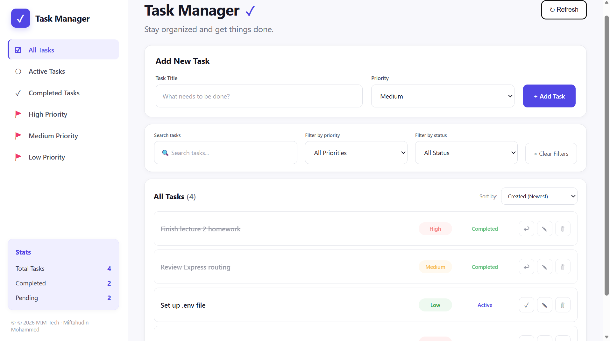
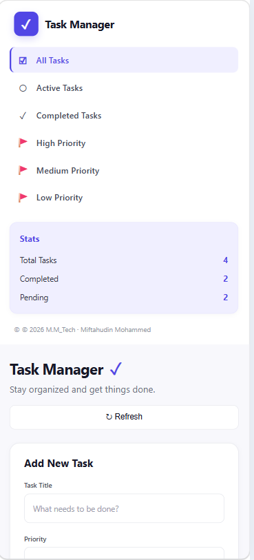

# 🧩 🗂️ Task Manager — REST API

> A full-stack task management application for creating, organizing, prioritizing, and tracking daily tasks.

---

## 🌐 Live Demo

**Frontend:**  
https://task-manager-project-1-lab0.onrender.com

**Backend API:**  
https://task-manager-project-4440.onrender.com

---

## 📖 About The Project

TaskNest is a full-stack Task Manager application built with **Node.js and Express.js**.

The project demonstrates a RESTful API using **MVC architecture**, environment configuration, validation, error handling, and a responsive frontend connected to the backend.

The application is deployed online using **Render**, with the frontend hosted as a Static Site and the backend deployed as a Web Service.

### Architecture

```text
Frontend
   ↓
REST API
   ↓
Routes
   ↓
Controllers
   ↓
Services
   ↓
Data
```

---

## 🚀 Features

- ➕ Create new tasks
- 🗂️ View and manage tasks
- 🔎 Search tasks by title
- 🎚️ Filter by priority and status
- ↕️ Sort tasks
- ✍️ Edit existing tasks
- 🗑️ Delete tasks
- 🔄 Toggle task completion
- 📈 View task statistics
- 🛡️ Input validation and error handling
- 📱 Responsive dashboard

---

## 🧰 Tech Stack

### Frontend

- HTML5
- CSS3
- JavaScript (ES6+)

### Backend

- Node.js
- Express.js

### Tools & Middleware

- Git & GitHub
- dotenv
- CORS
- REST API testing tools
- Render

---

## 🗃️ Project Structure

```text
task-manager-api/
│
├── backend/
│   ├── index.js
│   ├── .env
│   ├── config/
│   │   └── env.js
│   ├── routes/
│   │   └── taskRoutes.js
│   ├── controllers/
│   │   └── taskController.js
│   ├── services/
│   │   └── taskService.js
│   └── data/
│       └── taskData.js
│
├── frontend/
│   ├── index.html
│   ├── css/
│   │   └── style.css
│   └── js/
│       └── app.js
│
├── screenshots/
│
├── package.json
├── package-lock.json
├── .gitignore
└── README.md
```

---

## 🔗 API Endpoints

| Method | Endpoint         | Description      |
| ------ | ---------------- | ---------------- |
| GET    | `/api/tasks`     | Get all tasks    |
| GET    | `/api/tasks/:id` | Get a task by ID |
| POST   | `/api/tasks`     | Create a task    |
| PATCH  | `/api/tasks/:id` | Update a task    |
| DELETE | `/api/tasks/:id` | Delete a task    |

---

## 📸 Screenshots

### Desktop



### Mobile



---

## ⚙️ Installation

### 1. Clone the repository

```bash
git clone https://github.com/ibnumohammed99/task-manager-project.git
```

### 2. Navigate to the project

```bash
cd task-manager-api
```

### 3. Install dependencies

```bash
npm install
```

### 4. Create environment variables

Create a `.env` file inside the `backend` directory:

```env
PORT=3000
APP_NAME=Task Manager API
```

### 5. Start the development server

```bash
npm run dev
```

The API will run at:

```text
http://localhost:3000
```

### Frontend

Open a second terminal:

```bash
cd frontend
npx serve .
```

Then open the local frontend URL provided in the terminal.

---

## 🌐 Deployment

The project is deployed using **Render**.

### Backend

The Express.js REST API is deployed as a **Render Web Service**.

**Live API:**

https://task-manager-project-4440.onrender.com

### Frontend

The HTML/CSS/JavaScript frontend is deployed as a **Render Static Site**.

**Live Application:**

https://task-manager-project-1-lab0.onrender.com

The deployed frontend communicates with the deployed backend through the REST API.

---

## 🔐 Environment Variables

The backend uses environment variables for configuration.

Example:

```env
PORT=3000
APP_NAME=Task Manager API
```

The `.env` file is used locally and should **not be committed to GitHub**.

In production, environment variables are configured through the Render dashboard.

---

## 🔮 Future Improvements

- Add database persistence
- Add user authentication and authorization
- Add task due dates and reminders
- Add pagination
- Add task categories and tags
- Add automated testing
- Improve API documentation with Swagger/OpenAPI

---

## 👨‍💻 Author

**Miftahudin Mohammed**

Computer Science & Engineering Student

Adama Science and Technology University
